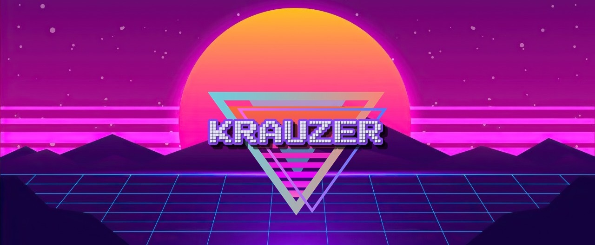


Welcome to my gaming backlog reviews blog!


I go through a variety of games from different eras and genres, from Super Nintendo and PlayStation, up to the most recently released titles. I mostly focus on retro, indies and double-A titles, more than big budget triple As, but I occasionally also play those aswel. My main platforms are the Steam Deck, a gaming PC and emulators. I also post my reviews on gaming backlog websites such as [Backloggd](https://backloggd.com/u/Krauzer/) and [Grouvee](https://www.grouvee.com/user/105340-Krauzer/).
